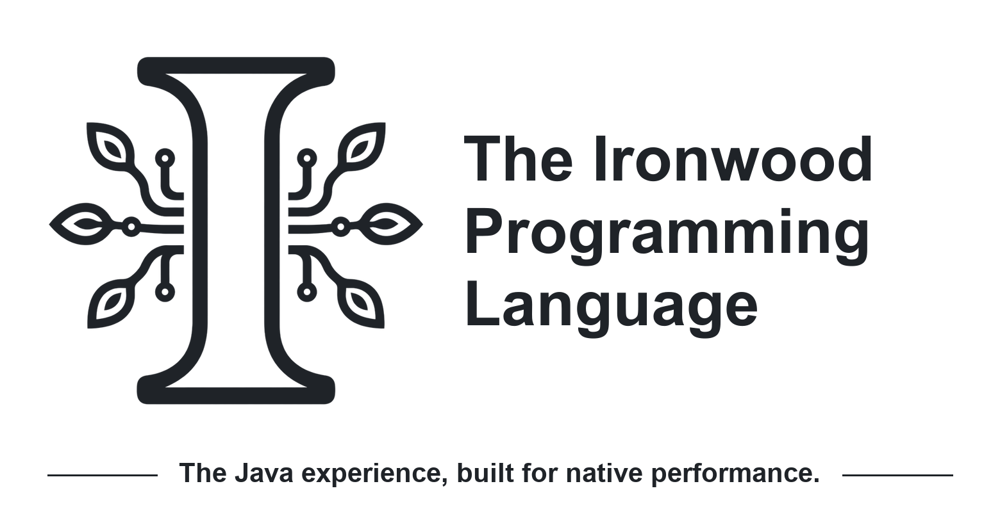

<!-- SPDX-License-Identifier: MIT OR Apache-2.0 -->

<p align="center">
  <picture>
    <source media="(prefers-color-scheme: dark)" srcset="assets/branding/ironwood-header-dark.png">
    <source media="(prefers-color-scheme: light)" srcset="assets/branding/ironwood-header-light.png">
    
  </picture>
</p>

Ironwood is an ahead-of-time compiled, object-oriented language for
high-performance native applications. It preserves the familiar Java syntax,
object model, and everyday APIs that Java developers already know, while
producing optimized native executables with no JVM, JIT, or garbage collector.
Ironwood is designed as a simpler, safer alternative to C++ without raw
pointers, borrow syntax, or an unfamiliar ownership-driven programming model.

## Why Ironwood?

- **Performance:** Compile directly to native executables with LLVM. Closed-world
  compilation lets the compiler optimize across the whole program, with no JVM,
  JIT, or garbage collector in the generated application. Profile-guided
  optimization and a compiler-owned `@Inline` directive are on the roadmap so
  Ironwood keeps pushing the envelope for maximum performance.

- **Safety:** Reclaim memory explicitly with compiler-proven `free` when you need
  to, or reuse objects through the native `ironwood.pool` standard library. The
  compiler rejects reclamation it cannot prove safe, preventing dangling
  references, double frees, and use after free. Allocations remain valid until
  an accepted `free` reclaims them or the process ends.

- **Familiarity:** Use the Java programming model you already know: classes and
  interfaces, inheritance and polymorphism, Java-width primitives, generics,
  exceptions, packages, and ordinary nullable references. Ironwood is designed
  to make Java developers feel at home from the first line of code.

## Hello World

If this looks familiar, that is intentional. Ironwood keeps Java's package and
class structure while compiling your application into a native executable.
Each top-level class lives in its own `.iron` file beneath the standard
`src/main/ironwood` source root:

```text
hello/
└── src/
    └── main/
        └── ironwood/
            └── org/
                └── ironwood/
                    └── hello/
                        ├── Chatter.iron
                        └── Hello.iron
```

### Hello.iron

```java
package org.ironwood.hello;

public class Hello {

    public static void main(String[] args) {

        Chatter chatter = new Chatter();

        System.out.println("Hello " + chatter.getWord() + "!");
    }
}
```

### Chatter.iron

```java
package org.ironwood.hello;

import ironwood.util.Random;

class Chatter {

    private static final String[] WORDS = { "World", "Ironwood", "Developers" };

    private final Random rand = new Random();

    String getWord() {
        int index = this.rand.nextInt(WORDS.length);
        return WORDS[index];
    }
}
```

With `ironwoodc` on your `PATH`, run these commands from the `hello` directory:

```sh
# Compile Hello.iron; Chatter.iron is found and compiled automatically.
ironwoodc -sourcepath src/main/ironwood -d target/classes \
  src/main/ironwood/org/ironwood/hello/Hello.iron

# Link the closed-world application into an optimized native executable.
ironwoodc --link -cp target/classes \
  --main-class org.ironwood.hello.Hello -o target/hello -O3

# Run the native executable.
./target/hello
```

Each run prints one of the three greetings:

```text
Hello Ironwood!
```

The resulting `target/hello` is a native executable. It does not need the IDK (Ironwood Development Kit), Java, a JVM, a JIT, or LLVM when deployed.

## Memory Management

Ironwood does not have a garbage collector so memory is never reclaimed automatically. For our short `Hello World` program that wouldn't be a problem but let's change it to show how Ironwood handles memory explicitly.

### Hello.iron

```java
package org.ironwood.hello;

public class Hello {

    public static void main(String[] args) {

        Chatter chatter = new Chatter();

        System.out.println("Hello " + chatter.getWord() + "!");

        free chatter; // bye

        // System.out.println(chatter); // DOES NOT COMPILE !!!
    }
}
```

### Chatter.iron

```java
package org.ironwood.hello;

import ironwood.util.Random;

class Chatter {

    private static final String[] WORDS = { "World", "Ironwood", "Developers" };

    private final Random rand = new Random();

    String getWord() {
        int index = this.rand.nextInt(WORDS.length);
        return WORDS[index];
    }

    destructor {
      free rand; // bye
    }
}
```

The cleanup above demonstrates how the same code can manage memory deterministically in a long-running native application. When execution reaches `free chatter;`, the compiler first proves that the object cannot be observed through another live reference. The `Chatter` destructor then runs and reclaims its privately owned `Random` instance before
the `Chatter` object itself is reclaimed. A destructor does not run merely because an object becomes unreachable. It runs as part of an accepted `free` operation.

If the compiler cannot prove that either reclamation is safe, compilation
fails. There is no unsafe fallback, and a successfully freed reference cannot
be used again.

```
Yes: no C++ dangling pointers or unpredictable references. The compiler won't allow it.
```

## Ironwood Standard Library

Ironwood strives to provide a standard library as close as possible to the JDK, if not identical. The exception is the absence of _collections_ in favor of the highly optimized single-threaded data-structures from `ironwood.ds`. For example, you can use an `ArrayList` with the code below.

```java
import ironwood.ds.ArrayList;
import ironwood.util.Iterator;

public class ListExample {
	
	public static void main(String[] args) {
		
		ArrayList<String> list = new ArrayList<>();
		list.add("Hi1");
		list.add("Hi2");
		
		Iterator<String> iter = list.iterator();
		while(iter.hasNext()) {
			System.out.println(iter.next());
		}
	}
}
```

For the IronDocs of the latest Ironwood Standard Library, you can <a href="docs/api/README.md">click here</a>.

## Ironwood vs GraalVM Native Image

Both Ironwood and GraalVM Native Image produce closed-world, ahead-of-time compiled native executables, but they start from different places. GraalVM Native Image compiles existing Java bytecode and carries the JVM machinery needed to preserve Java semantics into the executable. Ironwood is a separate language designed for native compilation from the ground up, with Java-familiar syntax, objects, and APIs, but no JVM, JIT, Java bytecode, or garbage collector in the generated application.

```
GraalVM makes Java native. Ironwood makes native development feel like Java.
```


