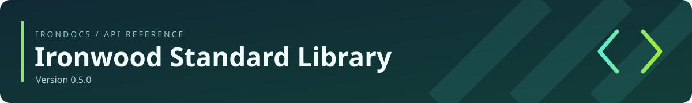

<!-- Generated by IronDocs. Do not edit. -->



**Version 0\.5\.0**

[All packages](../../README.md) / [`ironwood.net`](package-summary.md)

# Proxy.Type

**Enum** · `ironwood.net.Proxy.Type`

```java
public static enum Type
```

Selects direct TCP, an HTTP CONNECT tunnel, or a SOCKS tunnel.


## Member summary

[Enum constants](#enum-constants)

| Member | Description |
| --- | --- |
| [`DIRECT`](#member-DIRECT) | Connects directly without a proxy. |
| [`HTTP`](#member-HTTP) | Opens a TCP tunnel with HTTP CONNECT. |
| [`SOCKS`](#member-SOCKS) | Opens a TCP tunnel using the explicitly selected SOCKS version. |

## Enum constants

<a name="member-DIRECT"></a>

### `DIRECT`

```java
DIRECT
```

Connects directly without a proxy. Use `Proxy.NO_PROXY`.


[Back to member summary](#member-summary)

<a name="member-HTTP"></a>

### `HTTP`

```java
HTTP
```

Opens a TCP tunnel with HTTP CONNECT.


[Back to member summary](#member-summary)

<a name="member-SOCKS"></a>

### `SOCKS`

```java
SOCKS
```

Opens a TCP tunnel using the explicitly selected SOCKS version.


[Back to member summary](#member-summary)

---

Generated from Ironwood source comments with **IronDocs**.
