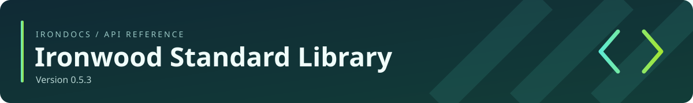

<!-- Generated by IronDocs. Do not edit. -->



**Version 0\.5\.3**

[All packages](../../README.md) / [`ironwood.net`](package-summary.md)

# NetworkInterface

**Class** · `ironwood.net.NetworkInterface`

```java
public final class NetworkInterface
```

Captured interface structure with live status queries. Individual lookup results own their
snapshot; enumeration elements borrow the enumeration's snapshot. Names, addresses, parents and
subinterfaces remain tied to that owner. Free caller-owned cursors and lists before the snapshot
owner, and never free borrowed entries separately. Status, MTU and hardware queries consult the
current host by the captured interface name and can fail if it disappears.


## Member summary

[Methods](#methods)

| Member | Description |
| --- | --- |
| [`getByName(String)`](#member-getByName-28-String-29-) | Captures the host interfaces and selects a matching name. |
| [`getByIndex(int)`](#member-getByIndex-28-int-29-) | Captures the host interfaces and selects a matching index. |
| [`getByInetAddress(InetAddress)`](#member-getByInetAddress-28-InetAddress-29-) | Captures the host interfaces and selects a matching address. |
| [`getNetworkInterfaces()`](#member-getNetworkInterfaces-28--29-) | Captures the current interfaces in a fresh owning enumeration. |
| [`getName()`](#member-getName-28--29-) | Returns the captured interface name, without a live host query. |
| [`getDisplayName()`](#member-getDisplayName-28--29-) | Returns the captured interface name as its display name on the supported native platforms. |
| [`getIndex()`](#member-getIndex-28--29-) | Returns the interface index captured with the snapshot. |
| [`isVirtual()`](#member-isVirtual-28--29-) | Tests whether the captured name identifies a colon-named subinterface. |
| [`getParent()`](#member-getParent-28--29-) | Returns the parent from the same captured snapshot. |
| [`getInetAddresses()`](#member-getInetAddresses-28--29-) | Creates a cursor over captured address values. |
| [`getSubInterfaces()`](#member-getSubInterfaces-28--29-) | Creates a cursor over captured child interfaces. |
| [`getInterfaceAddresses()`](#member-getInterfaceAddresses-28--29-) | Creates a mutable list containing borrowed address/prefix entries. |
| [`isUp()`](#member-isUp-28--29-) | Queries whether the interface is currently enabled using the captured interface name. |
| [`isLoopback()`](#member-isLoopback-28--29-) | Queries whether the interface is a loopback device using the captured interface name. |
| [`isPointToPoint()`](#member-isPointToPoint-28--29-) | Queries whether the interface is point-to-point using the captured interface name. |
| [`supportsMulticast()`](#member-supportsMulticast-28--29-) | Queries whether the interface supports multicast using the captured interface name. |
| [`getMTU()`](#member-getMTU-28--29-) | Queries the current maximum transmission unit using the captured interface name. |
| [`getHardwareAddress()`](#member-getHardwareAddress-28--29-) | Queries the current hardware address and copies it independently of the snapshot. |
| [`equals(Object)`](#member-equals-28-Object-29-) | Compares captured interface names and address membership. |
| [`hashCode()`](#member-hashCode-28--29-) | Hashes the captured interface name. |
| [`toString()`](#member-toString-28--29-) | Formats the captured interface name and display name without a live query. |

## Methods

<a name="member-getByName-28-String-29-"></a>

### `getByName(String)`

```java
public static NetworkInterface getByName(String name) throws SocketException
```

Captures the host interfaces and selects a matching name. A successful result owns its
snapshot independently of the input.

**Parameters**

| Name | Description |
| --- | --- |
| `name` | the interface name, borrowed only for this call |

**Throws**

| Exception | Condition |
| --- | --- |
| [`NullPointerException`](../lang/NullPointerException.md) | if name is null |
| [`SocketException`](SocketException.md) | if capturing the host interface snapshot fails |

**Returns**

a fresh caller-owned interface query, or null when no interface matches


[Back to member summary](#member-summary)

<a name="member-getByIndex-28-int-29-"></a>

### `getByIndex(int)`

```java
public static NetworkInterface getByIndex(int index) throws SocketException
```

Captures the host interfaces and selects a matching index. A successful result owns its
snapshot independently of the input.

**Parameters**

| Name | Description |
| --- | --- |
| `index` | a nonnegative interface index; zero never matches |

**Throws**

| Exception | Condition |
| --- | --- |
| [`IllegalArgumentException`](../lang/IllegalArgumentException.md) | if index is negative |
| [`SocketException`](SocketException.md) | if capturing the host interface snapshot fails |

**Returns**

a fresh caller-owned interface query, or null when no interface matches


[Back to member summary](#member-summary)

<a name="member-getByInetAddress-28-InetAddress-29-"></a>

### `getByInetAddress(InetAddress)`

```java
public static NetworkInterface getByInetAddress(InetAddress address) throws SocketException
```

Captures the host interfaces and selects a matching address. A successful result owns its
snapshot independently of the input.

**Parameters**

| Name | Description |
| --- | --- |
| `address` | an address to match, borrowed only for this call |

**Throws**

| Exception | Condition |
| --- | --- |
| [`NullPointerException`](../lang/NullPointerException.md) | if address is null |
| [`SocketException`](SocketException.md) | if capturing the host interface snapshot fails |

**Returns**

a fresh caller-owned interface query, or null when no interface matches


[Back to member summary](#member-summary)

<a name="member-getNetworkInterfaces-28--29-"></a>

### `getNetworkInterfaces()`

```java
public static Enumeration<NetworkInterface> getNetworkInterfaces() throws SocketException
```

Captures the current interfaces in a fresh owning enumeration. Returned interfaces and their
metadata borrow this snapshot. Exhausting the cursor does not reclaim it; free it only after
all borrowed values and subordinate cursors are no longer needed.

**Throws**

| Exception | Condition |
| --- | --- |
| [`SocketException`](SocketException.md) | if capturing the host interface snapshot fails |

**Returns**

a fresh caller-owned enumeration, possibly empty


[Back to member summary](#member-summary)

<a name="member-getName-28--29-"></a>

### `getName()`

```java
public String getName()
```

Returns the captured interface name, without a live host query.

**Returns**

name text borrowed from the snapshot owner


[Back to member summary](#member-summary)

<a name="member-getDisplayName-28--29-"></a>

### `getDisplayName()`

```java
public String getDisplayName()
```

Returns the captured interface name as its display name on the supported native platforms.

**Returns**

display text borrowed from the snapshot owner


[Back to member summary](#member-summary)

<a name="member-getIndex-28--29-"></a>

### `getIndex()`

```java
public int getIndex()
```

Returns the interface index captured with the snapshot.

**Returns**

the captured interface index


[Back to member summary](#member-summary)

<a name="member-isVirtual-28--29-"></a>

### `isVirtual()`

```java
public boolean isVirtual()
```

Tests whether the captured name identifies a colon-named subinterface. This does not
classify all host virtual network devices.

**Returns**

true for a colon-named subinterface


[Back to member summary](#member-summary)

<a name="member-getParent-28--29-"></a>

### `getParent()`

```java
public NetworkInterface getParent()
```

Returns the parent from the same captured snapshot. Do not free the result separately.

**Returns**

a borrowed parent interface, or null if there is none


[Back to member summary](#member-summary)

<a name="member-getInetAddresses-28--29-"></a>

### `getInetAddresses()`

```java
public Enumeration<InetAddress> getInetAddresses()
```

Creates a cursor over captured address values. The cursor and its elements borrow this
interface's snapshot; free the cursor before the owner, and do not free the addresses
separately.

**Returns**

a fresh enumeration owned by the caller


[Back to member summary](#member-summary)

<a name="member-getSubInterfaces-28--29-"></a>

### `getSubInterfaces()`

```java
public Enumeration<NetworkInterface> getSubInterfaces()
```

Creates a cursor over captured child interfaces. The cursor and its elements borrow this
interface's snapshot; free the cursor before the owner, and do not free the child interfaces
separately.

**Returns**

a fresh enumeration owned by the caller


[Back to member summary](#member-summary)

<a name="member-getInterfaceAddresses-28--29-"></a>

### `getInterfaceAddresses()`

```java
public ArrayList<InterfaceAddress> getInterfaceAddresses()
```

Creates a mutable list containing borrowed address/prefix entries. Mutating the list does
not alter the snapshot. Free the list before the snapshot owner; do not free its borrowed
entries separately.

**Returns**

a fresh list owned by the caller


[Back to member summary](#member-summary)

<a name="member-isUp-28--29-"></a>

### `isUp()`

```java
public boolean isUp() throws SocketException
```

Queries whether the interface is currently enabled using the captured interface name.

**Throws**

| Exception | Condition |
| --- | --- |
| [`SocketException`](SocketException.md) | if the live host query fails |

**Returns**

true if the current host flags report this property


[Back to member summary](#member-summary)

<a name="member-isLoopback-28--29-"></a>

### `isLoopback()`

```java
public boolean isLoopback() throws SocketException
```

Queries whether the interface is a loopback device using the captured interface name.

**Throws**

| Exception | Condition |
| --- | --- |
| [`SocketException`](SocketException.md) | if the live host query fails |

**Returns**

true if the current host flags report this property


[Back to member summary](#member-summary)

<a name="member-isPointToPoint-28--29-"></a>

### `isPointToPoint()`

```java
public boolean isPointToPoint() throws SocketException
```

Queries whether the interface is point-to-point using the captured interface name.

**Throws**

| Exception | Condition |
| --- | --- |
| [`SocketException`](SocketException.md) | if the live host query fails |

**Returns**

true if the current host flags report this property


[Back to member summary](#member-summary)

<a name="member-supportsMulticast-28--29-"></a>

### `supportsMulticast()`

```java
public boolean supportsMulticast() throws SocketException
```

Queries whether the interface supports multicast using the captured interface name.

**Throws**

| Exception | Condition |
| --- | --- |
| [`SocketException`](SocketException.md) | if the live host query fails |

**Returns**

true if the current host flags report this property


[Back to member summary](#member-summary)

<a name="member-getMTU-28--29-"></a>

### `getMTU()`

```java
public int getMTU() throws SocketException
```

Queries the current maximum transmission unit using the captured interface name.

**Throws**

| Exception | Condition |
| --- | --- |
| [`SocketException`](SocketException.md) | if the live host query fails |

**Returns**

the MTU in bytes


[Back to member summary](#member-summary)

<a name="member-getHardwareAddress-28--29-"></a>

### `getHardwareAddress()`

```java
public byte[] getHardwareAddress() throws SocketException
```

Queries the current hardware address and copies it independently of the snapshot.

**Throws**

| Exception | Condition |
| --- | --- |
| [`SocketException`](SocketException.md) | if the live host query fails |

**Returns**

fresh caller-owned hardware bytes, or null when no address is reported


[Back to member summary](#member-summary)

<a name="member-equals-28-Object-29-"></a>

### `equals(Object)`

```java
@Override
public boolean equals(Object other)
```

Compares captured interface names and address membership. Live status flags and MTU do not
participate.

**Parameters**

| Name | Description |
| --- | --- |
| `other` | the value to compare, or null |

**Returns**

true if the values are equal


[Back to member summary](#member-summary)

<a name="member-hashCode-28--29-"></a>

### `hashCode()`

```java
@Override
public int hashCode()
```

Hashes the captured interface name.

**Returns**

the hash code consistent with equality


[Back to member summary](#member-summary)

<a name="member-toString-28--29-"></a>

### `toString()`

```java
@Override
public String toString()
```

Formats the captured interface name and display name without a live query.

**Returns**

a fresh string owned by the caller


[Back to member summary](#member-summary)

---

Generated from Ironwood source comments with **IronDocs**.
