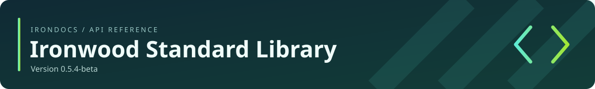

<!-- Generated by IronDocs. Do not edit. -->



**Version 0\.5\.4\-beta**

[All packages](../../README.md) / [`ironwood.net`](package-summary.md)

# SocketOptionDescriptor

**Interface** · `ironwood.net.SocketOptionDescriptor`

```java
public interface SocketOptionDescriptor
```

Describes an option independently of its specialized value type. Metadata and tokens in a socket
inventory are borrowed from that inventory's owner.


## Member summary

[Methods](#methods)

| Member | Description |
| --- | --- |
| [`name()`](#member-name-28--29-) | Returns the descriptive option name. |
| [`valueKind()`](#member-valueKind-28--29-) | Describes the option value shape without runtime class objects. |

## Methods

<a name="member-name-28--29-"></a>

### `name()`

```java
public String name()
```

Returns the descriptive option name. Built-in names are process-lifetime strings; custom
tokens define their text lifetime.

**Returns**

the option name, borrowed for built-in tokens


[Back to member summary](#member-summary)

<a name="member-valueKind-28--29-"></a>

### `valueKind()`

```java
public String valueKind()
```

Describes the option value shape without runtime class objects. Built-in tokens use `boolean` or `int`; custom tokens define their own description and text lifetime.

**Returns**

the value-kind description, borrowed for built-in tokens


[Back to member summary](#member-summary)

---

Generated from Ironwood source comments with **IronDocs**.
