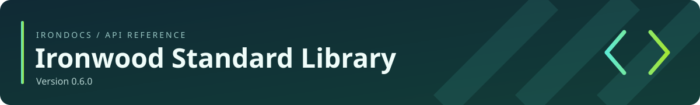

<!-- Generated by IronDocs. Do not edit. -->

**Version 0\.6\.0**

[All packages](../../README.md)

# `ironwood.bridge`

**Package reference**

| Type | Kind | Description |
| --- | --- | --- |
| [`ByteView`](ByteView.md) | class | A bounded byte range borrowed synchronously from the Java host. |

---

Generated from Ironwood source comments with **IronDocs**.
