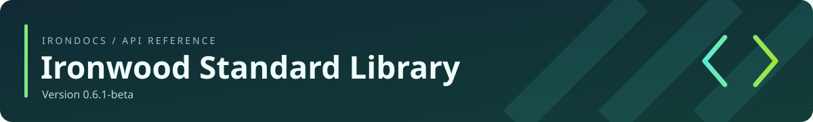

<!-- Generated by IronDocs. Do not edit. -->



**Version 0\.6\.1\-beta**

[All packages](../../README.md) / [`ironwood.bridge`](package-summary.md)

# ByteView

**Class** · `ironwood.bridge.ByteView`

```java
public final class ByteView
```

A bounded byte range borrowed synchronously from the Java host.


## Member summary

[Methods](#methods)

| Member | Description |
| --- | --- |
| [`length()`](#member-length-28--29-) | Returns the fixed number of accessible bytes. |
| [`isReadOnly()`](#member-isReadOnly-28--29-) | Reports this view's immutable write permission. |
| [`get(int)`](#member-get-28-int-29-) | Reads one signed byte at an absolute index. |
| [`put(int,byte)`](#member-put-28-int-2c-byte-29-) | Writes one byte; read-only permission is checked before the index. |

## Methods

<a name="member-length-28--29-"></a>

### `length()`

```java
public int length()
```

Returns the fixed number of accessible bytes.


[Back to member summary](#member-summary)

<a name="member-isReadOnly-28--29-"></a>

### `isReadOnly()`

```java
public boolean isReadOnly()
```

Reports this view's immutable write permission.


[Back to member summary](#member-summary)

<a name="member-get-28-int-29-"></a>

### `get(int)`

```java
public byte get(int index)
```

Reads one signed byte at an absolute index.


[Back to member summary](#member-summary)

<a name="member-put-28-int-2c-byte-29-"></a>

### `put(int,byte)`

```java
public void put(int index, byte value)
```

Writes one byte; read-only permission is checked before the index.


[Back to member summary](#member-summary)

---

Generated from Ironwood source comments with **IronDocs**.
