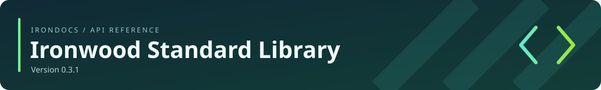

<!-- Generated by IronDocs. Do not edit. -->

# Ironwood Standard Library

Browse the reference for the version of Ironwood you use. Development documentation changes with the source; stable release documentation is frozen.

| Version | Status |
| --- | --- |
| [0.3.1](0.3.1/README.md) | New @SuppressUnfreed |
| [0.3.0](0.3.0/README.md) | Compiler free warnings |
| [0.2.5](0.2.5/README.md) | First public release |
